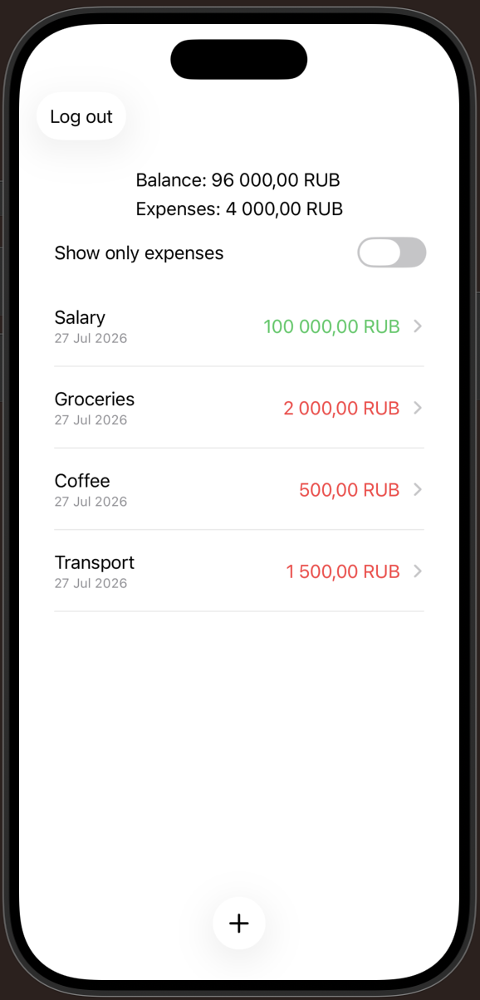

# Budget Planner

iOS-приложение для учета доходов и расходов, написанное на **SwiftUI** с использованием архитектуры **MVVM**

## Функциональность

- Просмотр списка операций
- Добавление новой операции
- Редактирование существующей операции
- Удаление операции
- Фильтрация только расходов
- Автоматический подсчет баланса и общей суммы расходов
- Отображение экрана загрузки
- Обработка ошибок при сохранении данных

## Технологии

- Swift
- SwiftUI
- MVVM
- Combine
- Codable
- Protocol-oriented programming
- XCTest

## Архитектура

Проект построен по архитектуре **MVVM**

- **Model** — описание финансовой операции
- **View** — отображение интерфейса
- **ViewModel** — бизнес-логика, загрузка данных, вычисление баланса, фильтрация операций и обработка пользовательских действий

Для работы с данными используется протокол `OperationsStorageProtocol`, благодаря чему источник данных можно заменить без изменения ViewModel

В текущей версии проекта используется `MockStorage`, что позволяет тестировать приложение независимо от конкретного способа хранения данных

## Структура приложения

- Login screen
- Operation list
- Operation details
- Add / Edit operation form

## Тесты

Проект содержит unit-тесты для проверки логики ViewModel:

- Добавление операции
- Удаление операции
- Редактирование операции
- Вычисление общего баланса
- Фильтрация операций

## Запуск проекта

1. Открыть проект в Xcode
2. Выбрать Simulator или устройство
3. Запустить приложение
